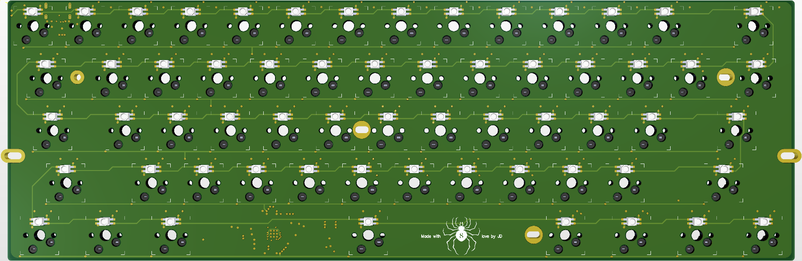

# 60% Mechancial Keyboard PCB
This repository showcases a 61-switch mechanical keyboard PCB made in Altium Designer for DFM with JLCPCB. The board is powered by a Raspberry Pi RP2040 chip on a 6-layer SIG-GND-PWR-SIG-GND-SIG stack up and follows the standard [GH60](https://github.com/komar007/gh60) layout + sizing for modern 60% mechanical keyboard cases. It features per-key RGB LED lighting, hot-swap sockets for MX-style switches, USB-C power & ESD protection, as well as support for UART, SWD, and UF2 bootloading. 

## Schematic
### Main Components

### Switch Matrix

### RGB Matrix

## 2D View

**Note:** L2, L3, and L5 are hidden in this image since the polygon pours reduce the visibility of the traces/routing.

## 3D View
### Front

### Back

